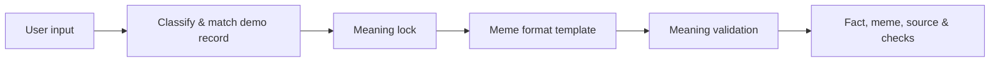

# MEMEFACT

> **Verify it. Simplify it. Meme it. Remember it.**

MEMEFACT is a Phase 1 prototype for PS2 — *Make Important Information Memeworthy*. It transforms a matched, authoritative public-awareness record into a concise meme while preserving a structured **meaning lock**. The final card shows the factual source, the canonical message, and validation results instead of treating the meme as the source of truth.

## Problem and solution

Health, cyber, climate, and public-safety guidance is often ignored when it is presented as a long notice. MEMEFACT makes the *presentation* memorable while keeping verified guidance and critical context separate and visible.

## Features

- Clear, single-screen demo flow for input → source match → meme → validation.
- 12 curated demo records: five cyber, two health, three climate, and two public-safety scenarios.
- Input classification (topic, claim, advice, or information), category selection, and four meme formats.
- Transparent **Demo Knowledge Base** mode: no live search or invented verification claims.
- Deterministic meaning lock and rule-based validation that rejects risky guaranteed claims.
- Clipboard sharing for meme, WhatsApp, Instagram, or the full result.
- Friendly empty, invalid URL, and unsupported-topic states.

## Architecture

```text
Browser UI
  │ input + category + format
  ▼
Demo knowledge-base matcher (local, curated records)
  ▼
Meaning lock { core message, context, preservation rules }
  ▼
Safe meme template ──► validation rules ──► rendered source + result
```



## Tech stack

- React 19, TypeScript, and Vite.
- Node’s built-in test runner for focused pipeline tests.
- No backend/database is needed in Phase 1 because demo records and the transparent provider fallback run locally in the browser.

## Project structure

```text
src/main.tsx       UI, curated source-provider data, meaning lock, templates, validation
src/styles.css     responsive visual system
tests/             unit and pipeline tests
.env.example       documented optional AI/search configuration
```

## Prerequisites

- Node.js 20.19+ (or 22.12+) is required by the current Vite release.
- npm 10+.

## Installation and run locally

These commands were verified for this repository:

```bash
git clone <your-repository-url>
cd FACTMX
npm install
npm run dev
```

Open the localhost URL printed by Vite (normally `http://localhost:5173`). For a production build:

```bash
npm run build
npm run preview
```

## Environment setup and modes

Copy `.env.example` to `.env` if you want to document local settings. The app needs **no API key** and defaults to transparent Demo Mode (`DEMO_MODE=true`). `AI_API_KEY` and `SEARCH_API_KEY` are reserved for a future provider implementation; no AI or live-search path is currently implemented, so supplying keys does not change behavior.

## Demo scenarios

Use the four **Judge-ready scenarios** buttons, or enter: OTP/UPI scams, phishing links, strong passwords/MFA, hand hygiene, vaccination guidance, energy conservation, waste sorting, water conservation, seat belts, or fire safety. The Cyber button demonstrates: *Never share your OTP with anyone who contacts you unexpectedly.*

## API

There are no network API endpoints in this Phase 1 local demo. The source-provider, generator, and validator execute in the browser against curated records. This is intentionally labelled in the UI so it is not confused with real-time verification.

## Testing

```bash
npm test
npm run build
```

The tests cover input classification, meaning-lock creation, validation, and an input → fact → meme → validation pipeline. Build runs TypeScript checking and Vite production compilation.

## Limitations and next phase

- Matching is keyword-based and supports the listed demo areas only; unsupported inputs are safely declined.
- Validation is transparent deterministic rule checking, not an LLM semantic evaluator.
- Sources are curated links used by local demo records; the application does not fetch or revalidate them live.
- Phase 2 can add a server-side `SourceProvider`, web retrieval with citations, an LLM provider interface, semantic validator, safer URL extraction, persistence, and downloadable image cards.
